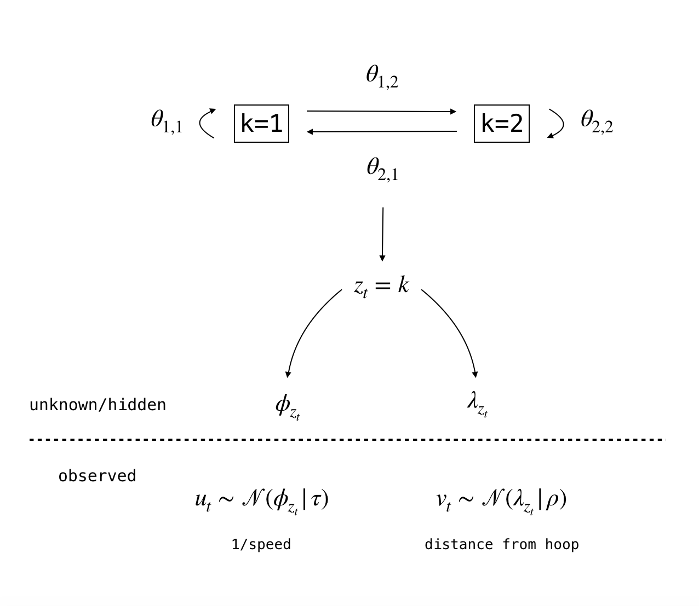

```{r setup, include=FALSE}
knitr::opts_chunk$set(echo = TRUE)
library(rstan)
library(bayesplot)
library(dplyr)
source("../graphics.R")
rstan_options(auto_write = TRUE)
```


## Introduction


This case study shows how we can apply Bayesian inference to Hidden Markov Models (HMMs) using [Stan](https://mc-stan.org/) to extract useful information from basketball player tracking data. Specifically we show how to tag drive events and how to determine defensive assignment. Before diving into basketball data we show how to fit an HMM in Stan using a simple example. This should help build some intuition for those who are unfamiliar with HMMs and will also show how to specify an HMM using Stan.

The code used to build this document is available in the following GitHub repository: https://github.com/imadmali/bball-hmm.


## Simple HMM Example


HMMs enable you to model a series of observed values. The generative model produces an observation for each latent state, so you also have a series of states that corresponds to the series of observed values. The state series exhibits the Markov property so the value of the state at time $t$ only depends on the value of the state at time $t-1$. Often the states are hidden so the goal of inference using an HMM is to,

1. Estimate the parameters that allow you to transition from one state to the next and (given the state) the parameters involved in generating the observation.
2. Predict the most likely state sequence based on the observed data and the parameters estimated in (1).

The plot below outlines an HMM that we simulated. The model involves one sequence of observed outcomes generated from the normal distribution and two states. At each time step we are in one of the two states. Each of the states corresponds to a location parameter from the normal distribution. This means that the observed value is generated depending on which one of two location parameters is selected, which in turn depends on which state you are in. In more complicated data you could have multiple observations and many more states at each time step.

You can see how state 1 corresponds to smaller values of the outcome while state 2 corresponds to relatively higher values of the outcome. In most real-word situations you do not know the state value at each time step because it is hidden. So in order to fit the model and infer the state sequence you first need to make an assumption as to how many possible states there might be at each time step.

```{r fig.align='center', fig.height=6, fig.width=9}
hmm_data <- readRDS("../data/hmm_example.RDS")
z <- hmm_data$z
y <- hmm_data$y
par(mfrow=c(2,1))
plot(hmm_data$z, type="s",
     main = "Hidden States",
     ylab = "State Value",
     xlab = "Time",
     ylim = c(0.5,2.5), yaxt = "n")
axis(2, 1:2, 1:2)
plot(hmm_data$y, type = "l",
     main = "Observed Output",
     ylab = "Observation Value",
     xlab = "Time")
y_plt <- hmm_data$y
y_plt[hmm_data$z==1] <- NA
lines(y_plt, lwd = 3)
legend("bottomright", c("State 1","State 2"), lty = c(1,1), lwd = c(1,3), cex = 0.8)
```

Suppose we don't know how many states there are at each time step $t$, but we assume that there are two states $z_t \in [1,2]$. The full generative model can be defined as,

$$
\begin{align*}
&y_t \sim \mathcal{N}(\mu_{z_t}, 1) \\
&z_t \sim \mathcal{Categorical}(\theta_{z_{[t-1]}}) \\
&\mbox{priors on } \mu_k \mbox{ and } \boldsymbol{\theta}\\
\end{align*}
$$

This says that the distribution of each observation $y_t$ is normal with location parameter $\mu_{z_t}$ and constant scale. There are two values that $z_t$ can take at each time step which means that there are two values of $\mu$. So we have $\mu_{z_t} \in [\mu_1,\mu_2]$. The model also says that the state variable follows the categorical distribution which is parameterized by $\theta_{z_[t-1]}$. Since $z_t$ can take two values, $\theta_{z_[t-1]}$ also takes two values. Given the properties of the categorical distribution $\theta_{z_[t-1]}$ sums to 1. This means that $\boldsymbol{\theta}$ is a $2 \times 2$ stochastic matrix (also known as a transition matrix).

A graphical representation of the model is provided below.

<div align='center'>
  
</div>

The parameters that we want to estimate in this model are the transition probabilities ($\boldsymbol{\theta}$) and the parameters associated with the emission probabilities ($\mu_1$,$\mu_2$).

* **Transition probabilities** govern how likely it is to move from one state to another or to stay within the same state. 
* **Emission probabilities** govern how likely the outcome was generated by that state.

We can interpret an element in the stochastic matrix $\boldsymbol{\theta}$ as the probability of going from the row state to the column state from time $t-1$ to time $t$. So the diagonal elements give the probability of staying in the same state, and the off-diagonal elements give the probability of transitioning from one state to the next. Continuing with our example we have,

* $\theta_{1,1}$: the probability of going from state 1 to state 1.
* $\theta_{2,2}$: the probability of going from state 2 to state 2.
* $\theta_{1,2}$: the probability of going from state 1 to state 2.
* $\theta_{2,1}$: the probability of going from state 2 to state 1.

Since the data in this example are normally distributed the emission probabilities come from the normal distribution. The emission probabilities depend on the location and scale parameter associated with each state (i.e. the emission parameters). In our model we assume the scale parameter is known and only have to estimate the location parameters $\mu_1$ and $\mu_2$ for states 1 and 2.

In order to estimate the parameters we need to define the posterior distribution which requires us to specify the likelihood of the data and the priors. The likelihood is defined by the probability of observing that particular sequence of outcome variables. Using the [forward algorithm](https://en.wikipedia.org/wiki/Forward_algorithm) we can efficiently calculate the likelihood of the data. The forward algorithm is computing the following marginalization efficiently,
$$
p(y | \theta, \mu) = \sum_{z} p(y,z | \theta, \mu)
$$

The priors are defined on the stochastic matrix and on the emission parameters. Since each row of the stochastic matrix sums to 1, a natural prior choice is the Dirichlet distribution on each row of the matrix.

We can then use Stan's variant of the [Hamiltonian Monte Carlo algorithm](https://en.wikipedia.org/wiki/Hamiltonian_Monte_Carlo) to estimate the stochastic matrix and emission parameters. Once we estimate the parameters we can determine the most probable state sequence that generated the sequence of observations. This can be computed with the [Viterbi algorithm](https://en.wikipedia.org/wiki/Viterbi_algorithm). 

### Specifying the Model

Below we represent the HMM in Stan (also available in `models/hmm_example.stan`). The `model {}` block specifies the priors and the forward algorithm to determine the most likely state at each point in time, and the `generated quantities {}` block specifies the Viterbi algorithm which enables us to determine the most likely state sequence. This model was adapted from the [Stan User's Guide](https://mc-stan.org/docs/2_18/stan-users-guide/hmms-section.html).

Notice that we have chosen to define $\mu$ as `positive_ordered[K] mu` instead of `real mu[K]`. This constraint is applied in order to enforce a strict separation between the two $\mu$ values associated with the two states. While in theory weak priors that order the parameters are sufficient to identify the model, in practice Stan needs better parameterization so we enforce an ordering. If we don't do this the sampling algorithm may struggle to find convergence among the parameter chains (see Betancourt 2017 for more detail). An example of omitting the constraint specification is provided in `models/hmm_example_bad.stan`.

```{stan eval=FALSE, output.var='hmm_example'}
data {
  int<lower=0> N;
  int<lower=0> K;
  real y[N];
}

parameters {
  simplex[K] theta[K];
  // real mu[K];
  positive_ordered[K] mu;
}

model {
  // priors
  target+= normal_lpdf(mu[1] | 3, 1);
  target+= normal_lpdf(mu[2] | 10, 1);
  // forward algorithm
  {
  real acc[K];
  real gamma[N, K];
  for (k in 1:K)
    gamma[1, k] = normal_lpdf(y[1] | mu[k], 1);
  for (t in 2:N) {
    for (k in 1:K) {
      for (j in 1:K)
        acc[j] = gamma[t-1, j] + log(theta[j, k]) + normal_lpdf(y[t] | mu[k], 1);
      gamma[t, k] = log_sum_exp(acc);
    }
  }
  target += log_sum_exp(gamma[N]);
  }
}

generated quantities {
  int<lower=1,upper=K> z_star[N];
  real log_p_z_star;
  {
    int back_ptr[N, K];
    real best_logp[N, K];
    for (k in 1:K)
      best_logp[1, k] = normal_lpdf(y[1] | mu[k], 1);
    for (t in 2:N) {
      for (k in 1:K) {
        best_logp[t, k] = negative_infinity();
        for (j in 1:K) {
          real logp;
          logp = best_logp[t-1, j] + log(theta[j, k]) + normal_lpdf(y[t] | mu[k], 1);
          if (logp > best_logp[t, k]) {
            back_ptr[t, k] = j;
            best_logp[t, k] = logp;
          }
        }
      }
    }
    log_p_z_star = max(best_logp[N]);
    for (k in 1:K)
      if (best_logp[N, k] == log_p_z_star)
        z_star[N] = k;
    for (t in 1:(N - 1))
      z_star[N - t] = back_ptr[N - t + 1, z_star[N - t + 1]];
  }
}
```

### Fitting the Model

We fit the model to the data provided above in order to estimate the parameters `theta` and `mu` along with the hidden state sequence `z_star`.

```{r results='hide', warning=FALSE}
# code available in hmm_example.R
stan_data <- list(N = length(hmm_data$y),
                  K = 2,
                  y = hmm_data$y)
hmm_fit <- stan("../models/hmm_example.stan", data = stan_data, iter = 1e3, chains = 4)
```

### Post-estimation Validation

The post estimation steps that we take to validate are,

1. **Diagnostics**: Make sure that each parameter sample converged. This can be evaluated by examining the R-hat and effective sample size values for each parameter.
2. **Predictions**: Specifically we perform a **posterior predictive check**. Using the estimated parameters and the predicted state sequence we can predict multiple output sequences and see if they line up with the observed output sequence. Additionally, since we know the true state values, we can check to make sure the predicted state values line up the true state values.

We go through these steps below.

#### Diagnostics

For the transition probabilities $\boldsymbol\theta{}$ and the parameters associated with the emission probabilities $\mu$ we have the following parameter estimates. 

```{r}
print(hmm_fit, pars = "z_star", include = FALSE, probs = c(0.05,0.95))
```

With `Rhat` values close to 1 and a high enough effective sample size (`n_eff`) we can conclude that our parameter estimates converged. 

We can also look at the traceplots to get an idea of what convergence among chains looks like.

```{r fig.align='center', fig.height=5, fig.width=10}
mcmc_trace(as.array(hmm_fit), regex_pars = "^theta\\[|^mu\\[", facet_args = list(nrow = 2))
```

Below we have diagnostics from a situation where priors are defined but an ordering is not enforced (see `hmm_example_bad_fit.R` for the code). You can see how the parameter chains look like they have not converged. Notice how we have `Rhat` values different from 1 and small effective sample sizes; all indicators of bad convergence.

```{r}
# code available in hmm_example_bad.R
hmm_bad_stan <- readRDS("../results/hmm_example_bad.RDS")
print(hmm_bad_stan$fit, pars = "z_star", include = FALSE, probs = c(0.05,0.95))
```

```{r fig.align='center', fig.height=5, fig.width=10}
mcmc_trace(as.array(hmm_bad_stan$fit), regex_pars = "^theta\\[|^mu\\[", facet_args = list(ncol = 2))
```

#### Posterior Predictions

Below we plot 100 predicted outcome sequences given the predicted states and emission parameter estimates. (These predictions could also be implemented in the `generated quantities {}` block of our Stan model.) Notice how these posterior predictions based on the data line up nicely with the observed output values. This is one indication that the data generation process was appropriately modeled.

```{r fig.align='center', fig.height=4, fig.width=9}
# extract samples
samples <- as.matrix(hmm_fit)
theta <- samples[,grep("^theta",colnames(samples))]
mu <- samples[,grep("^mu",colnames(samples))]
z_star <- samples[,grep("^z_star",colnames(samples))]

# simulate observations for each iteration in the sample
y_hat <- list()
for (i in 1:nrow(samples)) {
  psi_seq <- sapply(z_star[i,], function(x){mu[i,x]})
  y_hat[[i]] <- rnorm(length(psi_seq), psi_seq, 1)
}

# plot
indxs <- sample(length(y_hat), 100, replace = FALSE)
plot(hmm_data$y, type = "n",
     main = "Observed vs Predicted Output",
     ylab = "Observation Value",
     xlab = "Time",
     ylim = c(0,11))
for (i in indxs) {
  lines(y_hat[[i]], col = "#ff668890")
}
lines(hmm_data$y, lwd = 2)
legend("bottomright", c("Observed","Predicted"), col = c("#000000","#ff668890"), lty = c(1,1), lwd = c(2,1), cex = 0.8)

```

Below we overlay the predicted states with the true states. Similar to the conclusion above, our predictions line up nicely with the true values. Note that we can only do this because we know the true value of the hidden states. In situations where the states are truly hidden this step is infeasible.

```{r fig.align='center', fig.height=6, fig.width=9}
# visualization
par(mfrow=c(2,1))
plot(hmm_data$z, type="s",
     main = "Latent States",
     ylab = "State Value",
     xlab = "Time",
     ylim = c(0.5,2.5), yaxt = "n")
axis(2, 1:2, 1:2)
points(colMeans(z_star), cex = 0.5)
legend("bottomright", c("Actual","Predicted"), pch = c(NA,1), lty = c(1,NA), cex = 0.5)
plot(hmm_data$y, type = "l",
     main = "Observed Output",
     ylab = "Observation Value",
     xlab = "Time")
y_plt <- hmm_data$y
y_plt[hmm_data$z==1] <- NA
lines(y_plt, lwd = 3)
legend("bottomright", c("State 1","State 2"), lty = c(1,1), lwd = c(1,3), cex = 0.8)
```

We can now adapt the methodology discsussed in this section to identify a drive event and defensive assignment using basketball player tracking data.


## Tagging Drive Events


For those who are unfamiliar with basketball, a [drive](https://www.youtube.com/watch?v=SAp95x3iCCY) occurs when an offensive player dribbles the ball towards the hoop for a shot attempt (often a layup). We can translate a drive into two types of events that are happening simultaneously over time until the shot attempt,

* The player increases their speed.
* The player reduces the distance between himself and the basket.

The video below illustrates what a drive event looks like in the player tracking data (see `drive_data.R` for code). This drive possession was attributed to Zach LaVine in the Minnesota Timberwolves v Boston Celtics [game](https://stats.nba.com/game/0021500411/) on 12/21/2015.


<div align='center'>
<video autosize:true controls>
  <source src="../media/event_140.mp4" type="video/mp4">
</video>
</div>


### Pre-process Data

Using the player tracking data we can construct the speed and distance metrics associated with LaVine's drive event. We define speed as distance over time and use Euclidean distance to determine the player's distance from the hoop at each time step. Below we show these metrics along with the player tracking data (see `data/pt_data_evt140_drive.R` for code). Notice how LaVine decreases his distance from the basket and increases his speed as he drives to the hoop.


<div align='center'>
<video autosize:true controls>
  <source src="../media/event_140_stats.mp4" type="video/mp4">
</video>
</div>


It's apparent that the speed metric is pretty noisy. This may be attributed to the fact that time is measured in 25 hertz (1/25th of a second) and that location is determined by a computer vision algorithm and not a tracking chip attached to the player. There are many methods that can be used to smooth the data (e.g. splines). Here we use a basic rolling mean with a window of three time steps. In our example the data is not so noisy that it would affect the performance of our model so the smoothing is mostly for aesthetics and ease of interpretation. If the noise in the series was more extreme then we might want consider implementing a better smoothing method before fitting our model.

```{r fig.align='center', fig.height=9, fig.width=6}
drive_data <- readRDS("../data/evt140_0021500411.RDS")

lavine_speed_smooth <- rep(drive_data$game$lavine_speed[2],2)
for (i in 3:nrow(drive_data$game))
  lavine_speed_smooth[i] <- mean(drive_data$game$lavine_speed[(i-2):i], na.rm=TRUE)

drive_data <- readRDS("../data/evt140_0021500411.RDS")
par(mfrow = c(3,1))
plot(drive_data$game$lavine_dist, type = "l",
     main = "Distance from Hoop",
     xlab = "Time (25hz)", ylab = "Distance from Hoop")
plot(drive_data$game$lavine_speed, type = "l",
     main = "Raw Speed",
     xlab = "Time (25hz)", ylab = "Speed")
plot(lavine_speed_smooth, type = "l",
     main = "Smooth Speed",
     xlab = "Time (25hz)", ylab = "Speed")
```

Now that we have the transformed the data appropriately we can specify and fit the model. 

### Specifying and Fitting the Model

Here our HMM needs to infer two hidden states: drive and none, using both the speed and distance observed sequences. One approach would be to model 1/speed in order to get the speed and distance sequences to trend in the same direction as the drive and non-drive state (Keshri et al 2017). In this case a drive would be defined by,

* The player reduces their 1/speed (equivalent to increasing speed).
* The player reduces the distance between himself and the basket.

If the data are transformed in this way a natural modeling approach for the emission probabilities would be to use the exponential distribution function. Unfortunately this poses two issues:

1. **Scale of the data**: Both the distance and the speed metric are on very different scales. It would make sense to take the log of these data to normalize them but unfortunately this is infeasible since the support of the exponential distribution must be greater than or equal to 0.
2. **Computationally unstable**: The 1/speed transformation contains values that are mostly close to 0. This makes it difficult to use distributions that have most of their density around 0, such as the exponential distribution. The reason being that it will be difficult to discriminate between the "drive" and "none" states, since modeling 1/speed with the exponential distribution will attribute high probabilities to both states.

While it is mathematically more tractable to use the exponential distribution, we argue that such a choice to model the data generation process will be computationally unstable. Instead, we opt to use the normal distribution on both the 1/speed and distance metrics, enabling us to model the data on the log scale. 

With the normal distributions defined over the observed data, our HMM is defined as follows,

$$
\begin{align*}
u_t &\sim \mathcal{N}(\phi_{z_t}, \tau) \\
v_t &\sim \mathcal{N}(\lambda_{z_t}, \rho) \\
z_t &\sim \mathcal{Categorical}(\theta_{z_{[t-1]}}) \\
\theta_{z_t} &\sim \mathcal{Dir}(\alpha_{z_t}) \\
\end{align*}
$$

where $z_t \in [1,2]$, $\tau=\rho=0.1$, and $\alpha = [[4,2],[2,4]]$.

Below is a graphical representation of the process that we are trying to model. 

<div align='center'>
  
</div>

Now we can fit the model to LaVine's data for the single drive possession. We provide the model results and diagnostics below.

```{r}
# code available in drive_1.R
drive_stan <- readRDS("../results/drive_1.RDS")
print(drive_stan$fit, pars = 'z_star', include = FALSE, probs = c(0.05,0.95))
```

```{r fig.align='center', fig.height=5, fig.width=10}
mcmc_trace(as.array(drive_stan$fit), regex_pars = "^theta\\[|^psi\\[|^lambda\\[", facet_args = list(nrow = 2))
```

For comparison we implemented the exponential distribution version of the model in `drive_0.R`. In line with our theory we found that the parameter chains struggled to converge in some model runs, validating our approach to use the normal distribution to model the log-transformed data.

### Post-processing Data

We post-process the predicted state values and layer them on top of the original distance/speed plots to see if the predictions lined up with our logic. We also show the posterior predictions of the output values given the predicted states and estimated parameter values. While the posterior predictions don't completely track the variation in the data, they do line up with the states appropriately.

```{r fig.align='center', fig.height=9, fig.width=6}

samples <- as.matrix(drive_stan$fit)
phi <- samples[,grep("^phi", colnames(samples))]
lambda <- samples[,grep("^lambda", colnames(samples))]
z_star <- samples[,grep("^z_star", colnames(samples))]

phi_hat <- list()
lambda_hat <- list()
for (i in 1:nrow(samples)) {
  phi_seq <- sapply(z_star[i,], function(x){phi[i,x]})
  lambda_seq <- sapply(z_star[i,], function(x){lambda[i,x]})
  phi_hat[[i]] <- rnorm(length(phi_seq), phi_seq, 0.1)
  lambda_hat[[i]] <- rnorm(length(lambda_seq), lambda_seq, 0.1)
}

indxs <- sample(length(samples), 100, replace = FALSE)

par(mfrow = c(3,1))
# dist
plot(drive_stan$data$v, type = "n",
     main = "Distance from Hoop (log scale)",
     xlab = "Time (25hz)", ylab = "Distance from Hoop")
for (i in 1:length(indxs))
  lines(lambda_hat[[i]], col = "#ff668890")
lines(drive_stan$data$v, lwd = 2)
legend("topright", c("Observed","Predicted"), col = c("#000000","#ff668890"), lty = c(1,1), lwd = c(2,1), cex = 0.8)
# speed
plot(drive_stan$data$u, type = "n",
     main = "Smooth Speed",
     xlab = "Time (25hz)", ylab = "Speed (log scale)")
for (i in 1:length(indxs))
  lines(phi_hat[[i]], col = "#ff668890")
lines(drive_stan$data$u, lwd = 2)
legend("topright", c("Observed","Predicted"), col = c("#000000","#ff668890"), lty = c(1,1), lwd = c(2,1), cex = 0.8)
# states
plot(round(colMeans(z_star)), type = "l", pch = 1, cex = 0.5,
     main = "Hidden States",
     ylab = "State", xlab = "Time (25hz)",
     ylim = c(0.5, 2.5), yaxt = "n")
    axis(2, c(1,2), c("Drive", "None"), las = 2)
```

We can also layer the predicted latent states on top of the previous video for a more comprehensive view of how the state sequence behaves based on what's happening on the court. 


<div align='center'>
<video autosize:true controls>
  <source src="../media/drive_1.mp4" type="video/mp4">
</video>
</div>


It looks like things line up nicely. The drive event gets triggered only when the player dramatically reduces their distance to the basket and increases their speed. To be completely honest, the model did a good job at modeling this specific drive by Zach LaVine, not drives in general. In order for the parameters to comprehensively capture a drive we recommend running the model over a set of drive events performed by various players.


## Defensive Assignment


Our final task is to determine defensive assignment in basketball using HMMs. We follow an approach similar to Franks et al (2015). However, instead of fitting an HMM using the EM algorithm we fit the model in Stan. Before diving into the model we need to define what good basketball defense is. Arguably, good defensive positioning means that the defender is somewhere in the triangle defined by the location of the hoop, the ball, and the offensive player in question. While there are many edge cases to consider, this is a reasonable abstraction of basketball defense. An example of this positioning is illustrated below.

```{r fig.align='center', fig.width=5, fig.height=5}
h <- c(0,-1)
b <- c(0,1.5)
o <- c(-1,0.5)
d <- c(-0.3,0.3)
plot(rbind(h,b,o,h), type = "o",
     xlim = c(-2,1), ylim = c(-2,2),
     xlab = "", ylab = "", xaxt = "n", yaxt = "n",
     pch = 20)
points(d[1],d[2], pch = 20)
text(h[1],h[2], "hoop", pos = 1, cex = 0.8)
text(b[1],b[2], "ball", pos = 3, cex = 0.8)
text(o[1],o[2], "offensive player", pos = 2, cex = 0.8)
text(d[1],d[2], "defender", pos = 3, cex = 0.8)
```

This modeling approach assumes man-to-man defense is being run on the court, which is often the case in the NBA. This model doesn't deal with zone defense. (Although we could identify certain locations on the court as the appropriate location for a defender when running a zone defense and apply an HMM to that data. But then we would need some way of distinguishing whether a zone is being run or not.)

Using this definition, we model the defender's position $\d_{t}$ at time step $t$ as 2 draws from the normal distribution where the location parameter is defined as a convex combination of the hoop, ball, and offensive player coordinates.

$$
d_{t} \sim \mathcal{N}(\mu_{z_{t}}, \tau) \\
\mu_{z_t} = o_{z_t}\lambda_{1} + h\lambda_{3} + b_t\lambda_{2} \\
$$

The index $z_t \in [1,2,\ldots,5]$ represents the hidden states (one of the 5 offensive player). $d_t$ denotes the defensive player's coordinates (in this example we only consider one defender). $o_{z_t}$ is the position of the offensive player associated with state $z_t$, $h$ is the position of the hoop, and $b_t$ is the position of the ball. Because $\mu_{k}$ is a convex combination we also have the following constraint,

$$
\lambda_{1} + \lambda_{2} + \lambda_{3} = 1 \\
\Leftrightarrow \\
\sum_l{\lambda_l} = 1
$$
This specifies that $\lambda$ is a simplex (the sum of all the elements equals 1).

Putting the model together with the state stochastic matrix $\theta$ and prior distributions gives,

$$
d_{t} \sim \mathcal{N}(\mu_{z_{t}}, \tau) \\
\mu_{z_t} = o_{z_t}\lambda_{1} + h\lambda_{3} + b_t\lambda_{2} \\
z_{t} \sim \mbox{Categorical}(\theta_{z_{t-1}}) \\
\mbox{s.t. } \sum_l{\lambda_l} = 1 \\
\mbox{priors on } \lambda, \theta
$$

A good choice for priors on $lambda$ and each row of $\theta$ would be the Dirichlet distribution. For a single defender, this model determines which one of the five offensive players is being guarded at each time step.

### Simulated Data

Before applying the model directly to the player tracking data we should check to see if our model performs appropriately with simulated data. Working in this type of controlled situation will also provide some intuition on what we are trying to model. 

The figure below illustrates an overly simplified basketball possession. For 20 time steps we sample a fixed position of five offensive players (`o1` to `o5`) and the ball. (We do this with trivial noise to mimic the noisiness of the player tracking data.) We construct the hoop coordinate without noise since the position is fixed over time. With all these pieces in place we trace the path of a single defender in an upside-down parabola shape around the hoop.

```{r fig.align='center', fig.width=6, fig.height=6}
# code available in data/defense_example_data.R
defense_example <- readRDS("../data/defense_example.RDS") 
list2env(defense_example, .GlobalEnv)
# plot
plt_defense_example(defense_example, main = "Defense Example")
points(d[,1], d[,2], col = "#ff6688", pch = 0)
```

Since the ball and hoop locations do not change over time, the convex combination only varies based the offensive player under consideration. Intuitively we want the model to say that the defender is guarding a particular offensive player if the defender is closest to the convex combination generated by that offensive player. In order to do so, we need to estimate what the appropriate convex combination is.

We fit the model to the simulated data assuming that the convex combination parameters are known and fixed to $\lambda = [1/3,1/3,1/3]$. This approach strongly biases the model to prior knowledge about where defenders are situated when guarding offensive players. Specifically it states that the locations (offensive player, hoop, and ball) are equally weighted so that the convex combination (i.e. optimal defensive player positioning) is not skewed towards certain locations. For example if we specified $\lambda = [0.4,0.4,0.2]$ then the convex combination will be closer to the offensive player and the hoop, and farther away from the ball. In this situation, a defender who is closer to this convex combination will be assigned to the offensive player over a defender who is closer to the convex combination defined by $\boldsymbol{\lambda} = [1/3,1/3,1/3]$.

```{r}
# code available in defense_0a.R
# fixing convex combination parameter
defense_0a_stan <- readRDS("../results/defense_0a.RDS")
print(defense_0a_stan$fit, pars = "z_star", include = FALSE, probs = c(0.05,0.95))
```

The model below is similar to the model above except that it assumes $\lambda$ is not known and has to be estimated from the data. We can still incorporate prior information about defensive positioning by applying the appropriate prior distribution on $\lambda$. This will be less strict compared to declaring $\lambda$ explicitly. Here we use the following Dirichlet prior, $\lambda \sim \mathcal{Dir}(3,3,3)$. This approach lets us learn about $\lambda$ from the data, while accounting for our prior knowledge. More importantly, this gives us insight into the type of positioning defenders favor within the convex combination assumption.

```{r}
# priors on convex combination parameter
# code available in defense_0b.R
defense_0b_stan <- readRDS("../results/defense_0b.RDS")
print(defense_0b_stan$fit, pars = "z_star", include = FALSE, probs = c(0.05,0.95))
```

For each model we plot the states associated with each position for the defender (these correspond to the offensive player numbers). Additionally, we plot a convex combination $\mu_{z_[t=1]}$ for each offensive player. You can see how defensive assignment is related to how close the defender is to the convex combination. In this example the difference between fixing and estimating $\lambda$ is apparent. When we estimate $\lambda$ the defender favors positioning themselves closer to the offensive player and hoop, and father away from the ball. 

```{r fig.align='center', fig.width=12, fig.height=6}
samples_0a <- as.matrix(defense_0a_stan$fit)
samples_0b <- as.matrix(defense_0b_stan$fit)
z_star_0a <- samples_0a[,grep("^z_star", colnames(samples_0a))]
z_star_0b <- samples_0b[,grep("^z_star", colnames(samples_0b))]
z_star_0a <- colMeans(z_star_0a)
z_star_0b <- colMeans(z_star_0b)

lambda <- samples_0b[,grep("^lambda", colnames(samples_0b))]
lambda <- colMeans(lambda)

# compute convex combination given fixed lambda
mu_0a <- list(mu1 = t(rbind(o[1,1,],h,b[1,])) %*% c(1/3,1/3,1/3) %>% t %>% c,
              mu2 = t(rbind(o[2,1,],h,b[1,])) %*% c(1/3,1/3,1/3) %>% t %>% c,
              mu3 = t(rbind(o[3,1,],h,b[1,])) %*% c(1/3,1/3,1/3) %>% t %>% c,
              mu4 = t(rbind(o[4,1,],h,b[1,])) %*% c(1/3,1/3,1/3) %>% t %>% c,
              mu5 = t(rbind(o[5,1,],h,b[1,])) %*% c(1/3,1/3,1/3) %>% t %>% c)
# compute convex combination given lambda estimate
mu_0b <- list(mu1 = t(rbind(o[1,1,],h,b[1,])) %*% lambda %>% t %>% c,
              mu2 = t(rbind(o[2,1,],h,b[1,])) %*% lambda %>% t %>% c,
              mu3 = t(rbind(o[3,1,],h,b[1,])) %*% lambda %>% t %>% c,
              mu4 = t(rbind(o[4,1,],h,b[1,])) %*% lambda %>% t %>% c,
              mu5 = t(rbind(o[5,1,],h,b[1,])) %*% lambda %>% t %>% c)

par(mfrow = c(1,2))
# model defense_0a
plt_defense_example(defense_example, main = expression(paste("Defense Example: ", lambda, " Fixed")))
lambda_0a_txt <- paste(round(c(1/3,1/3,1/3),2), collapse = ",")
text(-2,1.9, bquote(paste(Lambda, " = [", .(lambda_0a_txt),"]")), pos = 4)
text(d[,1], d[,2], labels = paste(z_star_0a), col = "#ff668890")
text(mu_0a$mu1[1], mu_0a$mu1[2], expression(mu[1]), cex = 0.8)
text(mu_0a$mu2[1], mu_0a$mu2[2], expression(mu[2]), cex = 0.8)
text(mu_0a$mu3[1], mu_0a$mu3[2], expression(mu[3]), cex = 0.8)
text(mu_0a$mu4[1], mu_0a$mu4[2], expression(mu[4]), cex = 0.8)
text(mu_0a$mu5[1], mu_0a$mu5[2], expression(mu[5]), cex = 0.8)
# model defense_0b
plt_defense_example(defense_example, main = expression(paste("Defense Example: ", lambda, " Estimated")))
lambda_0b_txt <- sprintf("%.2f", round(lambda,2), collapse=",")
lambda_0b_txt <- paste(lambda_0b_txt, collapse = ",")
text(-2,1.9, bquote(paste(Lambda %~~% phantom(), "[", .(lambda_0b_txt),"]")), pos = 4)
text(d[,1], d[,2], labels = paste(z_star_0b), col = "#ff668890")
text(mu_0b$mu1[1], mu_0b$mu1[2], expression(mu[1]), cex = 0.8)
text(mu_0b$mu2[1], mu_0b$mu2[2], expression(mu[2]), cex = 0.8)
text(mu_0b$mu3[1], mu_0b$mu3[2], expression(mu[3]), cex = 0.8)
text(mu_0b$mu4[1], mu_0b$mu4[2], expression(mu[4]), cex = 0.8)
text(mu_0b$mu5[1], mu_0b$mu5[2], expression(mu[5]), cex = 0.8)
```

### Player Tracking Data

Now that we are confident in our model we can apply it to player tracking data. We select a event different from the one used in the previous section on tagging drives; one with more movement among players on the court. This possession still has the Minnesota Timberwolves as the offensive team and the Boston Celtics are the defensive team.

So far the models in this section have shown how to infer defensive assignment for only one defender. In order to apply this to event level player tracking data we need to determine defensive assignment for each of the 5 defenders over time. We implement this in Stan by using _all_ of the defensive player coordinates in the data. This means that $d$ has an extra dimension $I=5$. Now the dimensions of $d$ are (number of defenders, number of offensive players (states), number of time steps, number of coordinates (2)), which translates to (5,5,N,2) where N is defined by the length of the possession. Accordingly, we wrap the forward algorithm and the Viterbi algorithm in a loop to determine defensive assignment for each of the 5 defenders.

Mathematically we can represent this as,

$$
d_{i,t} \sim \mathcal{N}(\mu_{z_{t}}, \tau) \\
\mu_{z_t} = o_{z_t}\lambda_{1} + h\lambda_{3} + b_t\lambda_{2} \\
z_{t} \sim \mbox{Categorical}(\theta_{z_{t-1}}) \\
\mbox{s.t. } \sum_l{\lambda_l} = 1 \\
\mbox{priors } \\
\lambda \sim \mathcal{Dir}(6,6,6) \\
\theta_z \sim \mathcal{Dir}(6,6,6,6,6) \\
$$

Again, we specified the prior distribution on lambda to equally weight the locations in the convex combination, only this time with less variance. We specified a similar prior distribution on the stochastic matrix for each state.

Due to the computational cost of fitting the model to the entire data we lowered the resolution of the data by a factor of 10 (i.e. selecting every 10th observation in each observed sequence). We then interpolated the gaps by carrying the last infered state forward. The results of this model are provided below.

```{r}
# code available in defense_1_low_res.R
defense_1_stan <- readRDS("../results/defense_1_evt244_low_res.RDS")
print(defense_1_stan$fit, pars = "z_star", include = FALSE, probs = c(0.05,0.95))
```

Looking at the estimates of $\lambda$ it is clear that (based on this possession) the defenders favor positioning closer to the offensive player and hoop over the ball's location.

For comparison we fit a model assuming that the stochastic matrix $\theta$ is known (code available in `defense_2_low_res.R`). Here we fix each element of the stochastic matrix to 0.2. While the speed at which the model fit significantly increased, this is at the expense of not learning the stochastic matrix from the data/priors.

Finally, we can visualize what defensive assignment looks like when inferred from this HMM.

<div align='center'>
<video autosize:true controls>
  <source src="../media/defense_1_evt244_low_res.mp4" type="video/mp4">
</video>
</div>

It looks like the assignments line up appropriately based on what we are observing. Additionally, we can see some noticable switching and double teaming. Unfortunatley, it is difficult to validate the assingments unless we watch footage of the possession. 


## Conclusion


This exposition has provided some guidance on how to model several series of data, provided that you believe there is some hidden state sequence governing the generation of the data that you observe. We've shown how to fit a basic HMM with Stan and how to apply this methodology to basketball player tracking data. There are some interesting opportunties to extend our work.

One such opportunity is that revealing hidden states with HMMs can provide humans with assistance when labeling data. Rather than looking at raw footage and tagging events/assignment from scratch, we can use HMMs and some basic prior knowledge to preemptively label data which can be further refined by humans if necessary. With this refined data we can go back to the modeling step and use a fully supervised approach (now that we are certain about the hidden state sequence in addition to the observed data) to get better estimates of the parameters in the model.

For example, after a first pass to infer the state sequence, the parameters in our drive model may not be the best at identifying when a drive actually takes place. However, after the state sequence is refined through human auditing we can re-estimate the parameters so that or model is more appropriate.

Additionally, we can pair this modeling approach with other models to get a more comprehensive understanding of what's taking place on the court. Going back to the drive example, it's difficult to infer the type of shot that took place as as result of the drive. Was it a floater, a bank shot, a finger-roll? It's too hard to tell with just the coordinate level player tracking data. However, we could combine the player tracking data with computer vision algorithms that can determine the type of shot from video footage. This metadata can then be paired with the player tracking data to provide a more complete picture about the event that took place.


## Acknowledgements


Thanks to Bob Carpenter for valuable feedback, and to Dan Cervone for sharing the code to visualize the player tracking data on [GitHub](https://github.com/dcervone/EPVDemo).


## References


Betancourt M. (2017) https://mc-stan.org/users/documentation/case-studies/identifying_mixture_models.html.  

Cervone, D., D'Amour, A., Bornn, L. & Goldsberry, K. (2016) A Multiresolution Stochastic Process Model for Predicting Basketball Possession Outcomes. Version 3. https://arxiv.org/abs/1408.0777.

Franks, A., Miller, A., Bornn, L. & Goldsberry, K. (2015) Characterizing the spatial structure of defensive skill in professional basketball. Version 3. https://arxiv.org/abs/1405.0231.  

Keshri, S., Oh, M., Zhang, S. & Iyengar, G. (2017) [Automatic Event Detection in Basketball](http://nessis.org/nessis17/Keshri.pdf). Selected presentations from the 2017 NESSIS. http://nessis.org/nessis17.html.  

Keshri, S., Oh, M., Zhang, S. & Iyengar, G. (2019) [Automatic event detection in basketball using HMM with energy based defensive assignment](https://www.degruyter.com/view/j/jqas.2019.15.issue-2/jqas-2017-0126/jqas-2017-0126.xml). _Journal of Quantitiative Analysis in Sports_. 15(2), 141–153.  

Stan Development Team (2019) Stan Modeling Language User's Guide. Version 2.20. http://mc-stan.org.  

Stan Development Team (2019) Stan Language Reference Manual. Version 2.20. http://mc-stan.org.  


## Computing Environment


```{r}
devtools::session_info("rstan")
```


## Licenses


Code (c) 2019 Imad Ali, BSD 3  

Text (c) 2019 Imad Ali, licensed under CC-BY-NC 4.0.  


